# Dragon-Fractal-Generation

## Credit
All code in this repository is written by me (Jesse Lam) and my collaborator (Samuel Isakov). Sources used to understand the nature of our project was the Wikipedia page about the Dragon Curve Fractal, where we examined the visual models and animations of the curve's generation to inspire the algorithm we wrote, and [this article published by Agnes Scott College](https://larryriddle.agnesscott.org/ifs/heighway/goldenDragon.htm), which inspired us to explore different shapes.

My main focus was developing the code to create fractals from existing coordinates.

My collaborator's main focus was solving to add a colour gradient to the generated image and determining a final shape to improve the aesthetic of our fractal.

## How to Run
Download the compressed executable from releases.
Extract this zip file and navigate to fractal/dist/fractal. 
From there, the executable may be run.

If you are using Windows, you will need to use to use a python IDE (such as Thonny) or run the program through the console using the command "python fractal.py" on the file after cloning the repository. I am unfortunately not able to access a Windows computer and cannot compile to Windows or know if the .exe works. 

If you are running the program through the terminal, you will need to install tk (for tkinter module).

## Project Description
My partner and I researched the generation of a complex family of fractals called the Dragon Curves. We first created the code to generate the most basic curve of this form. Then, we added a custom "turning-scheme" and edited the "seed" that the fractal was recursively built from to obtain more unique shapes.

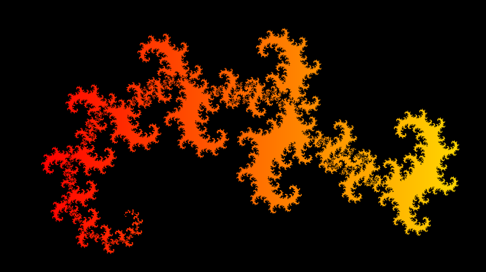

## Code Overview
The original dragon curve that we set out to examine was the most basic form of the Heighway Dragon curve. This curve can be iteratively generated by cloning a shape and rotating it by 90 degrees to form the next iteration, starting from a line segment, as we learned from this [Wikipedia demonstration](https://en.wikipedia.org/wiki/Dragon_curve):

However, this had 2 major problems. At each iteration, the size of the fractal would grow, and it would need to be rescaled constantly. Additionally, this requires the entire fractal to be moved as a whole while our code only worked on individual coordinates.

As an alternative to this, we found that an equivalent way of generating this fractal is by creating an intermediate point between two original points. By progressing halfway across the line segment formed by those two points and traveling an equivalent distance up, we could create an right triangle formed by those 3 points. 

We can loop between every consecutive pair of points in our fractal in order to generate each new iteration. The only requirement is to have rotation, translation, and scaling operations for the points first. Additionally, the vertical offset needs to alternate between clockwise and counterclockwise each turn.

Dist() and Towards() retunr the distance and angle between two points respectively. Rotranslate() was then used to transform and scale the position of new points relative to the original pairs of points.

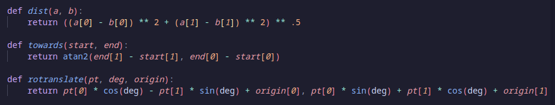

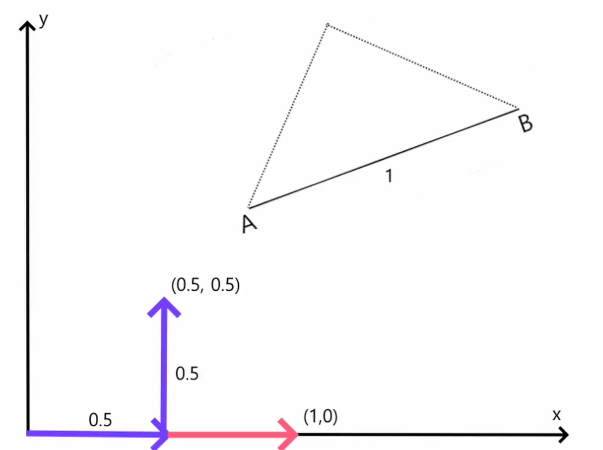
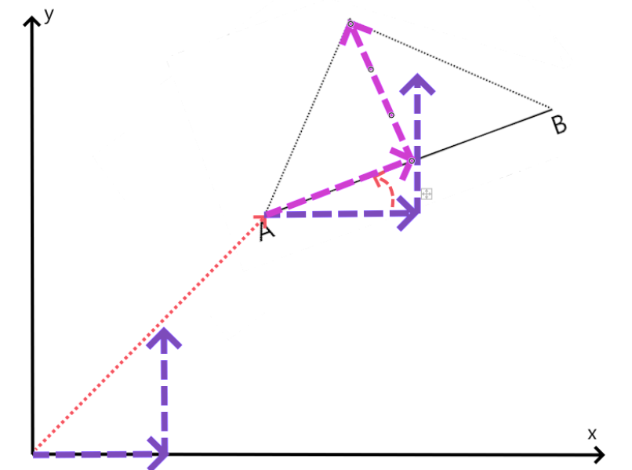

Afterward, we were successfully able to create our first fractal. The red line is the origin form of the fractal.

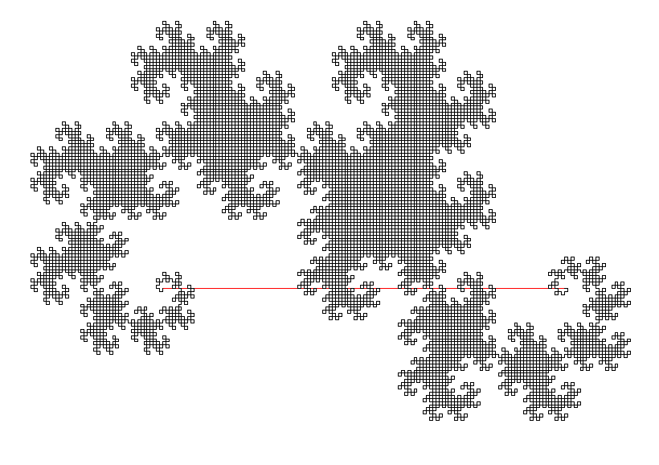

However, we learned something new. Larry Riddle's article from Agnes Scott College demonstrated that we could easily make new variations using this code. He, for example, generated a "golden dragon curve," which had the triangle's sidelengths appear in ratios of the golden ratio. This could be done by adjusting how far along the line segment that the third point travels before going a vertical distance.

Here, px and py are percentages of the x and y distances that intermediate points form between two points. Depending on the current turn in the instruction array, which holds a sequence of 0 and 1 to define whether the intermediae points are each step should be moving clockwise or counterclockwise.

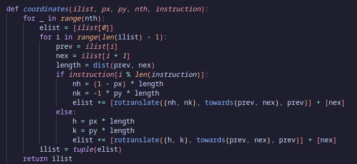

First, we attempted and verified that this method would work by achieving the same fractal as Larry Riddle had.

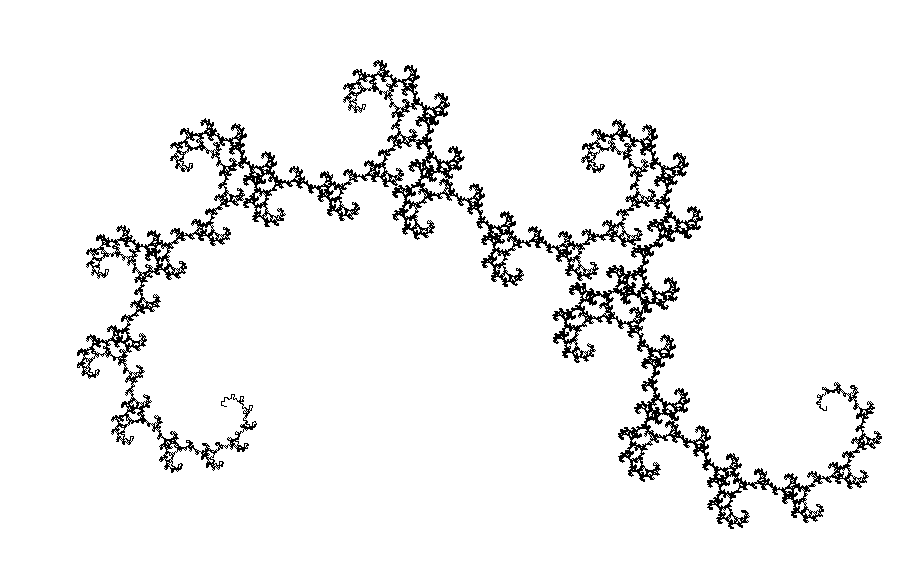

Next, we attempted to discover alternative ways that we could create unique fractals. We could alter the "seed" of the fractal by changing the initial shape. We could change the turning scheme which was defined for the set of points. By editing these 3 factors, the initial set of points, the turning scheme, and the relative position of intermediate points, we end up with drastically different variations of these fractal

Along with our final decision on the shape of the curve, we added color making the project look quite aethetic along with the new and interesting fractals we were able to generate.

Our final shape had these parameters:

initial_shape =  ((-300, 0), (74.19915379779962, 242.02302109782485), (300, 0), (-300, 0))

turning_scheme = (0, 0, 1)

## Further Examples
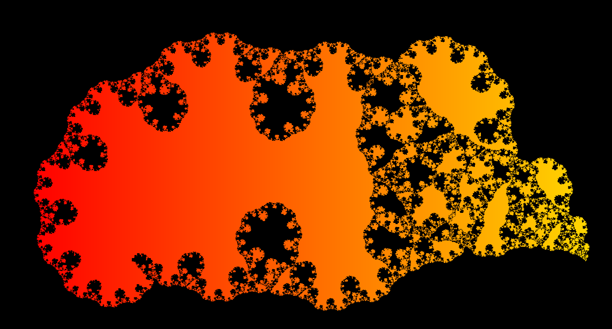
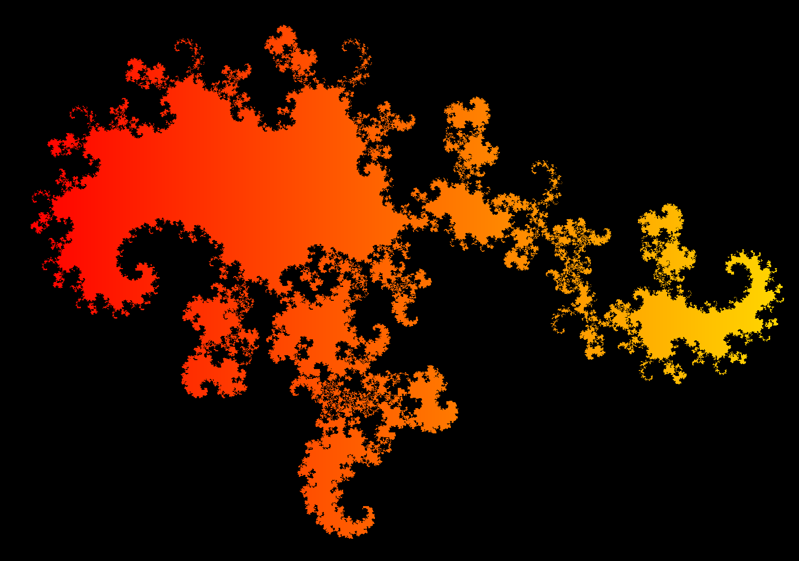

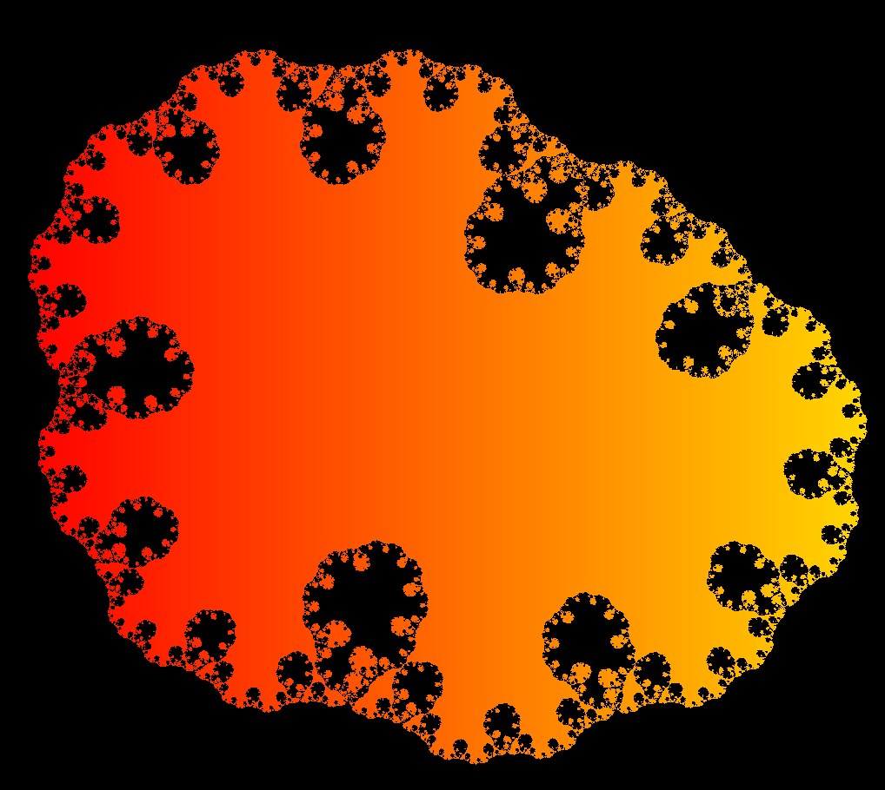
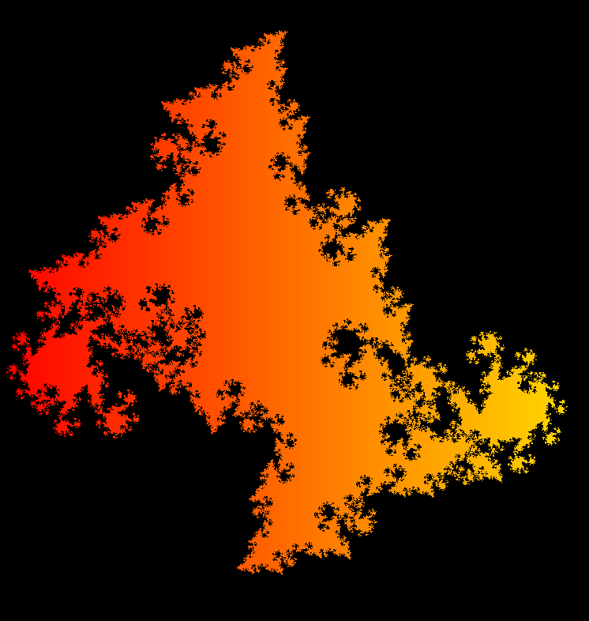